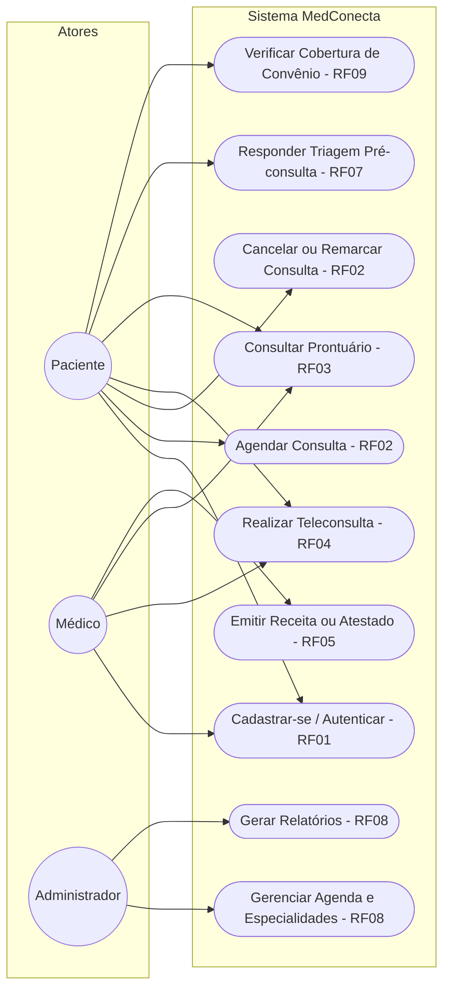
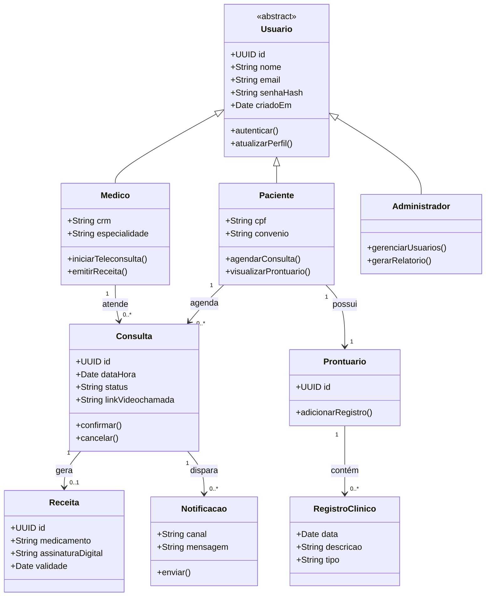
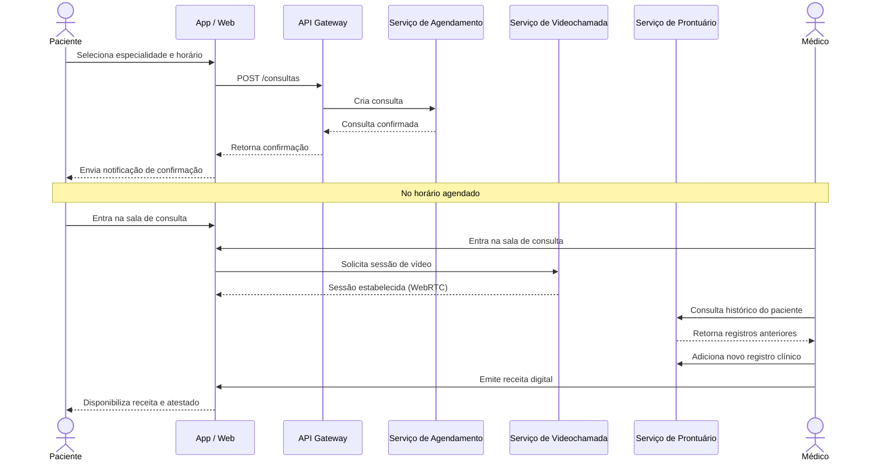

# Parte 2 — Modelagem e Linguagem de Projeto

Os diagramas abaixo usam a notação **UML**, representados em **Mermaid** — o GitHub renderiza esses blocos automaticamente na visualização do `.md`, sem necessidade de imagens externas.

## 2.1 Diagrama de Casos de Uso

Representa os três atores do sistema (Paciente, Médico, Administrador) e suas interações principais, rastreáveis aos requisitos funcionais da Parte 1.

## 2.2 Diagrama de Classes

Modelo conceitual das principais entidades do domínio e seus relacionamentos.

## 2.3 Diagrama de Sequência — fluxo de teleconsulta

Complementa os diagramas estáticos mostrando a ordem temporal das interações entre paciente, médico e os serviços do sistema, do agendamento até a emissão da receita.

## 2.4 Rastreabilidade

Cada caso de uso do diagrama 2.1 corresponde a um ou mais requisitos funcionais listados em `docs/01-requisitos.md`, e cada classe do diagrama 2.2 é persistida conforme os requisitos não funcionais de confiabilidade (histórico imutável) e segurança (criptografia de campos sensíveis) descritos na Parte 3.
