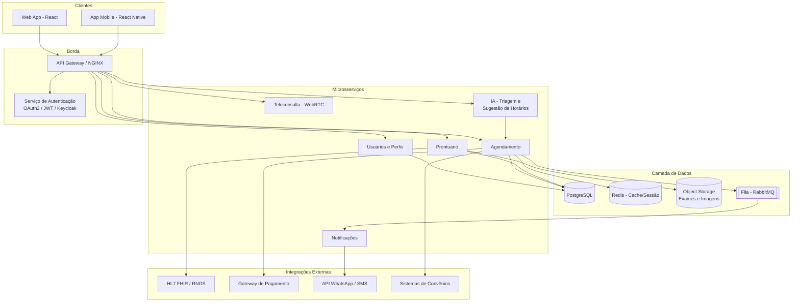

# Parte 4 — Arquitetura, Conectividade e Tecnologias

## 4.1 Visão geral da arquitetura

O MedConecta é desenhado como um conjunto de **microsserviços** por trás de um API Gateway, o que permite escalar isoladamente o serviço mais exigido (por exemplo, o de videochamada) sem precisar escalar o sistema inteiro — atendendo diretamente ao RNF de desempenho e escalabilidade definido na Parte 1.

## 4.2 Stack tecnológica e justificativa

| Camada | Tecnologia escolhida | Justificativa (ligada a RNF) |
|---|---|---|
| Frontend Web | React + TypeScript | Tipagem estática reduz bugs em produção (confiabilidade); grande ecossistema de bibliotecas de acessibilidade para atender WCAG. |
| Aplicativo mobile | React Native | Reaproveita boa parte da lógica e dos componentes do frontend web, acelerando entrega em Android e iOS ao mesmo tempo (portabilidade). |
| Backend — serviços principais | Node.js com NestJS | Modelo assíncrono não bloqueante é adequado a um sistema com muitas chamadas de I/O (banco, filas, chamadas externas); NestJS organiza os microsserviços em módulos, facilitando manutenção. |
| Serviço de IA (triagem/sugestão) | Python com FastAPI | Ecossistema de Python é o padrão de mercado para modelos de machine learning; FastAPI expõe esse modelo como uma API leve e rápida, isolada dos demais serviços. |
| Banco de dados principal | PostgreSQL | Banco relacional com suporte a transações ACID, essencial para consistência de agendamento e prontuário (RNF de confiabilidade). |
| Cache / sessão | Redis | Reduz latência de leituras frequentes (ex.: disponibilidade de horários) e armazena sessões, atendendo ao RNF de desempenho. |
| Armazenamento de arquivos | Object Storage compatível com S3 (ex.: MinIO/AWS S3) | Armazenamento de exames e imagens médicas fora do banco relacional, otimizado para arquivos binários grandes. |
| Videochamada | WebRTC, via provedor gerenciado (ex.: Daily.co) ou Jitsi self-hosted | Padrão aberto de comunicação em tempo real, com baixa latência, atendendo ao RNF de desempenho definido para a teleconsulta. |
| Mensageria assíncrona | RabbitMQ | Desacopla o envio de notificações (e-mail/SMS/WhatsApp) do fluxo principal de agendamento, evitando que uma falha no provedor de notificação afete o agendamento em si. |
| Autenticação | OAuth2 / OpenID Connect via Keycloak | Solução madura e testada para MFA, controle de papéis (RBAC) e integração futura com login de convênios (SSO). |
| Infraestrutura | Docker + Kubernetes | Permite escalar horizontalmente serviços específicos sob demanda (ex.: mais réplicas do serviço de videochamada em horário de pico). |
| CI/CD | GitHub Actions | Automatiza testes e implantação a cada alteração no repositório, reduzindo risco de regressão. |

## 4.3 Interoperabilidade e conectividade

O sistema não funciona isolado — ele precisa trocar dados com o ecossistema de saúde já existente:

- **HL7 FHIR** — padrão internacional de troca de dados clínicos. O serviço de Prontuário expõe e consome recursos FHIR (`Patient`, `Encounter`, `Observation`), permitindo que hospitais e clínicas parceiras integrem seus próprios sistemas ao MedConecta sem depender de um formato proprietário.
- **RNDS (Rede Nacional de Dados em Saúde)** — iniciativa do Ministério da Saúde/DATASUS para interoperabilidade entre sistemas de saúde no Brasil; a integração permite, por exemplo, registrar teleconsultas realizadas e consultar dados já existentes do paciente na rede pública.
- **APIs de convênios/planos de saúde** — integração via REST para verificar cobertura (RF09) e, futuramente, enviar guias de atendimento eletronicamente.
- **Gateway de pagamento** (ex.: Stripe, PagSeguro) — para consultas particulares, com webhook de confirmação de pagamento antes da liberação do agendamento.
- **API do WhatsApp Business / provedor de SMS** (ex.: Twilio) — canal de notificação preferido por grande parte dos pacientes, usado pelo Serviço de Notificações (RF06).
- **Documentação da API própria** — todos os endpoints do MedConecta são documentados em **OpenAPI/Swagger**, permitindo que futuros parceiros (laboratórios, farmácias parceiras para envio de receita) integrem seus sistemas ao MedConecta.

Essa combinação garante que o MedConecta funcione tanto como uma plataforma autônoma quanto como uma peça conectada a um ecossistema de saúde maior — um requisito prático para qualquer sistema de telemedicina que pretenda operar em escala real.
